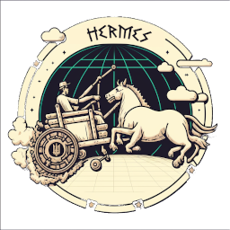

# hermes
Fast currency converter based on Binance API.

## 🇺🇦 Help Ukraine
I woke up on my 26th birthday at 5 am from the blows of russian missiles. They attacked the city of Kyiv, where I live, as well as the cities in which my family and friends live. Now my country is a war zone. 

We fight for democratic values, freedom, for our future! Once again Ukrainians have to stand against evil, terror, against genocide. The outcome of this war will determine what path human history is taking from now on.

💛💙  Help Ukraine! We need your support! There are [dozen ways][ukr-link] to help us, just do it!

## Table of Contents
- [hermes](#hermes)
  - [🇺🇦 Help Ukraine](#-help-ukraine)
  - [Table of Contents](#table-of-contents)
  - [Requirements](#requirements)
  - [Environment](#environment)
  - [Build](#build)
  - [External Dependencies:](#external-dependencies)
  - [Usage](#usage)

## Requirements

To work with extention you need to have [node](https://nodejs.org) and [npm](https://www.npmjs.com) installed in your machine:

* node `>=10`
* npm `>=6`

## Environment

install npm modules:

```npm ci```

## Build

to assemble firefox build, run the following:

```npm run build:firefox```

## External Dependencies:

* ```jquery 3.6.0```
* ```select2 4.0.13```
* ```underscore 1.13.4```
* ```underscore 1.13.4```
* ```backbone 1.4.1```

external dependencies are stored in [lib](./lib) already minified.

## Usage

1. Select text with currency symbol (i.e "1.5 BTC"). 
2. Then right-click on the context menu and select "Convert currency". 
1. A sidebar with conversation results will be shown.


[ukr-badge]: https://img.shields.io/badge/made_in-ukraine-ffd700.svg?labelColor=0057b7
[ukr-link]: https://war.ukraine.ua
